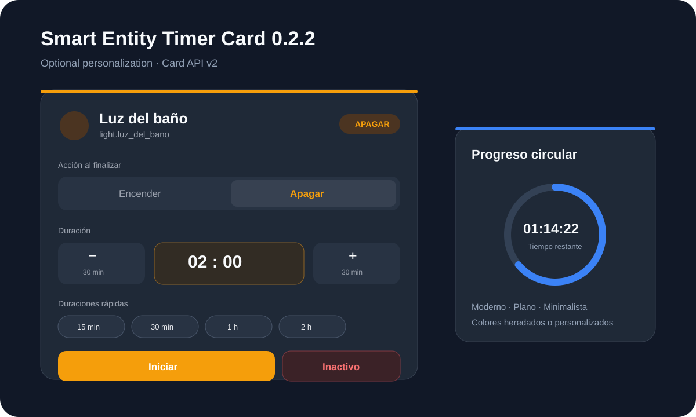

# Smart Entity Timer Card

A responsive and configurable Home Assistant dashboard card for the [Smart Entity Timer integration](https://github.com/abel-smart-timer/smart-entity-timer).



**Version:** 0.2.2  
**Required backend:** Smart Entity Timer 0.1.3 or newer (`card_api_version: 2`)

## What is new in 0.2.2

Version 0.2.2 fixes the custom-color application bug found during real HAOS testing. In 0.2.1 the RGB values selected in the visual editor were saved correctly, but the derived CSS variables were resolved on `:host` while the custom values were attached to `ha-card`. Because the variables lived in different CSS scopes, the rendered controls kept their default theme colors.

0.2.2 resolves derived and selected variables on the same `ha-card` scope, so custom colors now apply to Start, Timer ON, Cancel, disabled controls, Turn on/Turn off accents, progress, quick durations, and the selected quick duration.

The customization scope is intentionally limited to:

- practical per-control custom colors;
- fixed or selectable action;
- bar, ring, or time-only progress;
- independently visible/hidden sections;
- automatic, digital, or text time format;
- configurable quick-duration presets;
- modern, flat, or minimal visual styles.

## Requirements

- Home Assistant 2026.7.0 or newer.
- Smart Entity Timer integration 0.1.3 or newer.
- A configured Smart Entity Timer helper.

## Core behavior

- Choose **Turn on** or **Turn off**, or make a card permanently ON-only/OFF-only.
- Enter any duration in hours and minutes.
- Use configurable `−30 min` / `+30 min` adjustment buttons.
- Use optional quick-duration presets such as 15, 30, 60, and 120 minutes.
- Start and cancel with correct disabled states.
- Live countdown calculated locally without writing every second to Home Assistant.
- React to completion, manual cancellation, automatic cancellation, restart restoration, skipped actions, and errors.
- Synchronize duration/action changes across multiple phones, tablets, and browsers through Card API v2.
- Configure the card with Home Assistant's visual editor.

## Manual installation / update

1. Copy `dist/smart-entity-timer-card.js` to:

   `/config/www/smart-entity-timer-card/smart-entity-timer-card.js`

2. Configure the dashboard resource as **JavaScript Module**:

   `/local/smart-entity-timer-card/smart-entity-timer-card.js?v=0.2.2`

3. If upgrading, change the existing resource query to `?v=0.2.2`.
4. Hard-refresh the browser or fully close/reopen the Home Assistant mobile app.

## Minimal configuration

```yaml
type: custom:smart-entity-timer-card
entity: sensor.luz_del_bano_estado
```

This preserves the familiar default behavior: selectable ON/OFF action, modern style, bar progress, automatic time format, and no quick presets until configured.

## Example: personalized card

```yaml
type: custom:smart-entity-timer-card
entity: sensor.luz_del_bano_estado
name: Temporizador baño
icon: mdi:timer-outline
increment_minutes: 30
layout: auto
visual_style: modern
action_mode: selectable
progress_style: ring
time_format: auto
quick_times:
  - "15"
  - "30"
  - "60"
  - "120"
show_header: true
show_target_state: true
show_action_selector: true
show_duration_controls: true
show_quick_times: true
show_progress: true
show_status: true
show_last_result: true
color_start: [46, 175, 104]
color_timer_active: [74, 112, 245]
color_cancel: [219, 68, 55]
color_inactive: [125, 125, 125]
color_turn_on: [46, 175, 104]
color_turn_off: [232, 132, 61]
color_progress: [74, 112, 245]
color_quick: [120, 120, 120]
color_quick_selected: [92, 75, 219]
```

All color fields are optional. If omitted, the card inherits Home Assistant theme colors.

## Example: OFF-only compact card

```yaml
type: custom:smart-entity-timer-card
entity: sensor.aire_acondicionado_estado
action_mode: turn_off
layout: compact
visual_style: minimal
progress_style: time
time_format: digital
quick_times:
  - "30"
  - "60"
  - "120"
show_target_state: false
```

When `action_mode` is fixed, the ON/OFF selector is hidden. The fixed action is applied to the backend immediately before starting from that card. This allows multiple cards for the same timer to present different fixed actions without changing the backend merely by being displayed.

## Configuration reference

### General

| Option | Default | Description |
|---|---|---|
| `entity` | required | Smart Entity Timer status sensor using Card API v2. |
| `name` | target name | Optional card title. |
| `icon` | action-dependent | MDI icon. |
| `increment_minutes` | `30` | Amount added/removed by the step buttons. |
| `layout` | `auto` | `auto`, `compact`, `expanded`. |
| `visual_style` | `modern` | `modern`, `flat`, `minimal`. |

### Action and duration

| Option | Default | Description |
|---|---|---|
| `action_mode` | `selectable` | `selectable`, `turn_on`, or `turn_off`. |
| `quick_times` | `[]` | List of quick preset durations in minutes. |
| `progress_style` | `bar` | `bar`, `ring`, or `time`. |
| `time_format` | `auto` | `auto`, `digital`, or `text`. |

`auto` shows a human-readable programmed duration while idle and a digital countdown while active. `digital` uses a clock-like value in both states. `text` uses values such as `1 h 30 min` and includes seconds while active.

### Visibility

| Option | Default |
|---|---:|
| `show_header` | `true` |
| `show_target_state` | `true` |
| `show_action_selector` | `true` |
| `show_duration_controls` | `true` |
| `show_quick_times` | `true` |
| `show_progress` | `true` |
| `show_status` | `true` |
| `show_last_result` | `true` |

`show_action_selector` has no visual effect when `action_mode` is fixed because fixed-action cards intentionally hide the selector.

### Optional colors

The visual editor uses Home Assistant RGB color selectors. Empty values inherit the Home Assistant theme. The controls map directly to visible UI elements instead of tinting the whole card.

| Option | Controls |
|---|---|
| `color_start` | Enabled **Start** button |
| `color_timer_active` | Disabled **Timer ON** button while the timer is running |
| `color_cancel` | Enabled **Cancel** button |
| `color_inactive` | Disabled/inactive Start and Inactive button states |
| `color_turn_on` | Turn-on selector, badge and action accents |
| `color_turn_off` | Turn-off selector, badge and action accents |
| `color_progress` | Progress bar, ring and time-only progress value |
| `color_quick` | Unselected quick-duration buttons |
| `color_quick_selected` | Selected quick-duration button |

The experimental full-card background color from 0.2.0 was removed because it was not useful in real dashboard testing.

For advanced YAML use, safe CSS color strings such as `#3366ff`, `rgb(...)`, `hsl(...)`, named colors, and `var(--theme-variable)` remain accepted.

## Visual styles

### Modern

The default style. Uses rounded accent surfaces, soft shadows, gradients, and layered controls.

### Flat

Uses solid colors, visible borders, flatter corners, no elevation, and no gradients. Selected actions and presets become solid-color controls.

### Minimal

Removes most decorative containers, uses underline-style selectors and presets, tighter spacing, smaller controls, and no accent strip or elevation. Visibility options still decide which sections are present.

## Progress modes

### Bar

Horizontal elapsed-progress bar with remaining/programmed time.

### Ring

Circular elapsed-progress indicator with the time in the center.

### Time

Shows only the time value and its label; no graphical progress track.

## Synchronization contract

Home Assistant remains the single source of truth. Duration/action changes are written through:

```yaml
action: smart_entity_timer.set_values
target:
  entity_id: sensor.luz_del_bano_estado
data:
  duration_minutes: 90
  end_action: turn_off
```

The status sensor then publishes the authoritative values to every open card. The card does not query the Entity Registry for companion entities.

## Compatibility with 0.1.1 configurations

The following continues to work unchanged:

```yaml
type: custom:smart-entity-timer-card
entity: sensor.luz_del_bano_estado
increment_minutes: 30
layout: auto
show_target_state: true
show_last_result: true
```

All 0.2.x options have safe defaults matching the familiar card behavior.

## Development validation

```bash
npm run check
npm test
```

The test suite checks syntax, Card API v2 synchronization, external state reconciliation, fixed actions, presets, time formats, RGB colors, style modes, visibility options, and confirms that normal operation does not query the Entity Registry.

## License

MIT
